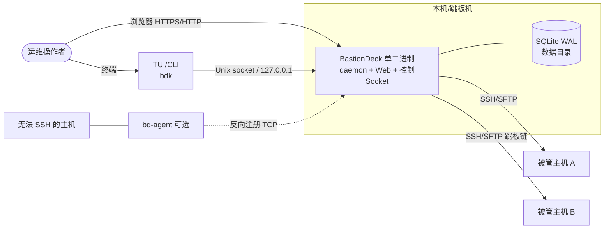
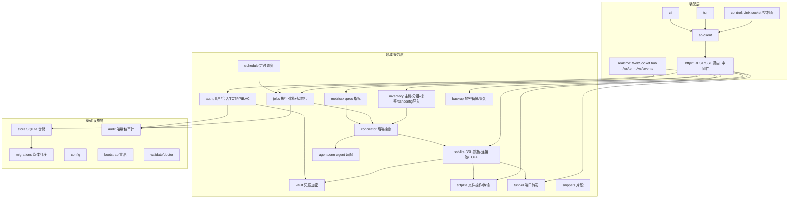
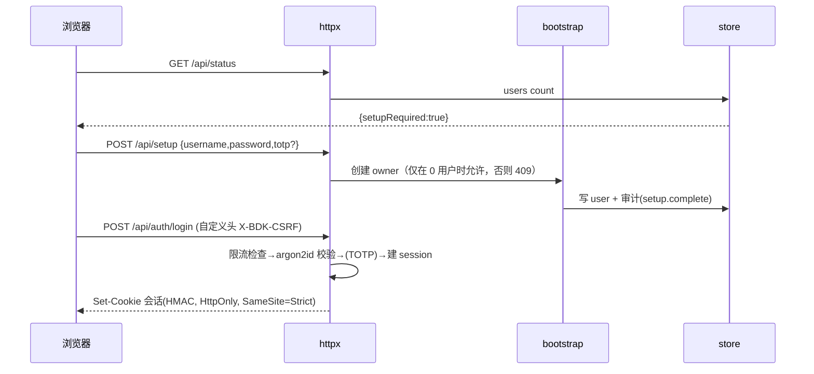
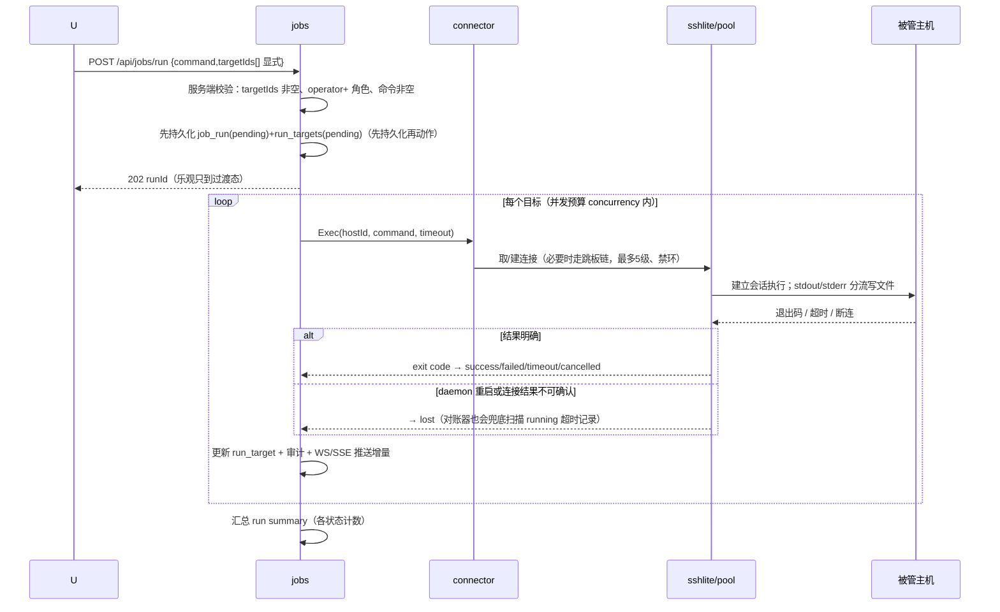

# BastionDeck 架构设计文档（Architecture）

> 配套文档：`01-charter.md`（立项）、`03-api-contract.md`（接口契约）。
> 本文描述 M0 冻结的目标架构；所有实现必须与此一致，偏离需补 ADR。

## 1. 架构约束与原则

1. **单二进制部署物**：`go:embed` 把前端构建产物嵌入；一个 CGO-free 静态文件 + 一个数据目录即可运行。
2. **一守护进程，三界面**：Web 走显式 TCP（默认回环 127.0.0.1:8840）；TUI/CLI 默认走本地 Unix socket（Linux/macOS）或命名管道等价物，控制面不暴露到网络。
3. **依赖方向单向向内**：`cmd → internal/装配层(httpx/control/tui/cli) → 领域服务(inventory/jobs/...) → store/vault 基础设施`；领域层不得 import HTTP/WS/TUI。
4. **状态唯一权威来源是 SQLite（WAL）**；内存缓存只做派生，重建必须可由数据库回放。
5. **先持久化再动作**：任务/执行先落库为 pending，再驱动外部 SSH；外部结果不明时落 `lost`，不猜成功。
6. **失败显式**：错误分类具名（如 `host_key_changed`、`vault_locked`、`jump_cycle`），不吞错；前端只渲染服务端给出的状态机状态。
7. **安全默认值拉满**：默认回环监听、不开 CORS、自定义头 CSRF、登录限流、凭据只密文落库、日志脱敏、危险操作服务端二次校验。
8. **可测试性内建**：SSH 后端抽象为 `Connector` 接口，测试用进程内伪 SSH 服务器（loopback fixture），不依赖个人 `~/.ssh` 与真实主机。

## 2. C4 视图

### 2.1 L1 系统上下文



### 2.2 L2 容器（进程/运行时）

| 容器 | 技术 | 职责 |
|---|---|---|
| daemon 主进程 | Go | HTTP server、控制 socket server、后台调度器（对账/指标/定时任务/清理）、连接池、WS hub |
| 浏览器前端 | React SPA（嵌入） | 全部用户界面，xterm 终端经 /ws/term 直连 daemon |
| bdk/tui 客户端进程 | Go | 经同一套 API 客户端访问 daemon，无独立业务逻辑 |
| bd-agent 进程 | Go（独立 module/二进制） | 装在被管机上，主动外连 daemon，转发执行/事实/指标 |

### 2.3 L3 组件图（daemon 内部）



## 3. 模块职责与边界（internal/）

| 包 | 职责 | 不允许做的事 |
|---|---|---|
| `config` | 环境变量/flag 解析、默认值、数据目录解析 | 不读数据库 |
| `version` | 版本/提交时间，ldflags 注入 | — |
| `bootstrap` | setupRequired 判定、首启 owner 创建向导后端 | 不做日常鉴权 |
| `store` | SQLite 打开、WAL、仓储 CRUD、事务 helper | 不含业务规则 |
| `migrations` | 顺序迁移、版本表、失败不部分登记 | 不跳版本 |
| `vault` | 主密钥加载/派生、AES-256-GCM 加解密、AAD 绑定 | 明文不落日志 |
| `auth` | argon2id、TOTP、会话 token(HMAC 签名 cookie/header)、RBAC 判定、登录限流 | 不直接渲染页面 |
| `audit` | 审计写入、哈希链计算、分页/导出、链校验 | 不做访问控制 |
| `inventory` | 主机/分组/标签/收藏/备注、ssh config 解析导入、跳板环检测 | 不发起真实连接 |
| `connector` | `Connector` 接口 + 工厂：按主机选择 ssh/agent 后端 | 不关心协议细节 |
| `sshlite` | 拨号、跳板链、Pool、TOFU、Exec、PTY、keepalive、超时 | 不存业务数据 |
| `sftplite` | 列目录、读写、原子写、乐观锁、传输任务、进度 | — |
| `tunnel` | local/remote forward 生命周期、计数、停止 | — |
| `jobs` | 执行计划、并发预算、状态机、日志缓冲与落盘、取消、对账 | 不实现 SSH |
| `snippets` | 片段 CRUD、变量渲染（白名单转义） | 不自动执行多行粘贴 |
| `schedule` | 5 字段 cron-lite 解析、下次触发时间、错过策略 | 不引入外部 cron 库 |
| `metricsx` | /proc 解析、序列降采样、7 天保留清理 | 不做告警 |
| `realtime` | WS hub：终端字节流、事件广播、presence；SSE 降级 | — |
| `agentconn` | agent 反向连接注册表、agent 协议适配为 Connector | 不主动外连 agent |
| `backup` | 加密导出/导入、暂存校验、恢复前安全副本 | 恢复不自动 apply |
| `httpx` | 路由、JSON 编解码、中间件（auth/rbac/csrf/ratelimit/recover/log） | 不写业务规则 |
| `control` | Unix socket 上的本地控制 API（复用 httpx handler） | 不做远程监听 |
| `apiclient` | Go SDK：登录、主机、任务、文件、WS 终端 | TUI/CLI/测试共用 |
| `tui` | ANSI 终端界面：主机列表/详情/执行/任务 | 只经 apiclient |
| `cli` | `bdk` 子命令路由 | 同上 |
| `webui` | go:embed 前端 dist、静态资源兜底、CSP 头 | — |
| `validate` | doctor 各项检查 | 只读 |

## 4. 数据模型（SQLite DDL 基线）

迁移 `0001_init.sql`（WAL；所有表含 `created_at/updated_at` 毫秒时间戳 TEXT ISO-8601）：

```sql
PRAGMA journal_mode=WAL;
PRAGMA foreign_keys=ON;

CREATE TABLE schema_migrations(version INTEGER PRIMARY KEY, applied_at TEXT NOT NULL);

-- 用户与认证
CREATE TABLE users(
  id TEXT PRIMARY KEY,                 -- usr_ 前缀 + 随机
  username TEXT NOT NULL UNIQUE,
  display_name TEXT NOT NULL DEFAULT '',
  role TEXT NOT NULL CHECK(role IN ('owner','admin','operator','viewer')),
  password_hash TEXT NOT NULL,         -- argon2id 编码串
  totp_secret_enc BLOB,                -- vault 加密后的 TOTP 密钥
  totp_enabled INTEGER NOT NULL DEFAULT 0,
  disabled INTEGER NOT NULL DEFAULT 0,
  must_change_password INTEGER NOT NULL DEFAULT 0,
  last_login_at TEXT,
  created_at TEXT NOT NULL, updated_at TEXT NOT NULL
);
CREATE TABLE sessions(
  id TEXT PRIMARY KEY,                 -- 随机 token 的 SHA256 存储
  user_id TEXT NOT NULL REFERENCES users(id) ON DELETE CASCADE,
  created_at TEXT NOT NULL, expires_at TEXT NOT NULL,
  last_seen_at TEXT NOT NULL, user_agent TEXT, ip TEXT,
  revoked INTEGER NOT NULL DEFAULT 0, revoke_reason TEXT
);
CREATE TABLE login_attempts(
  id INTEGER PRIMARY KEY AUTOINCREMENT,
  username TEXT NOT NULL, ip TEXT NOT NULL, ok INTEGER NOT NULL, at TEXT NOT NULL
);

-- 凭据保险库（密文）
CREATE TABLE credentials(
  id TEXT PRIMARY KEY,                 -- crd_
  name TEXT NOT NULL,
  kind TEXT NOT NULL CHECK(kind IN ('password','private_key')),
  ciphertext BLOB NOT NULL,            -- AES-256-GCM nonce||ct，AAD=id
  fingerprint TEXT,                    -- 公钥指纹（密钥类），便于展示
  created_by TEXT NOT NULL REFERENCES users(id),
  created_at TEXT NOT NULL, updated_at TEXT NOT NULL
);

-- 主机清单
CREATE TABLE host_groups(id TEXT PRIMARY KEY, name TEXT NOT NULL UNIQUE,
  parent_id TEXT REFERENCES host_groups(id), created_at TEXT NOT NULL, updated_at TEXT NOT NULL);
CREATE TABLE hosts(
  id TEXT PRIMARY KEY,                 -- hst_
  name TEXT NOT NULL, address TEXT NOT NULL, port INTEGER NOT NULL DEFAULT 22,
  username TEXT NOT NULL,
  credential_id TEXT REFERENCES credentials(id) ON DELETE SET NULL,
  auth_kind TEXT NOT NULL DEFAULT 'credential' CHECK(auth_kind IN ('credential','agent')),
  agent_id TEXT,                       -- agent 后端时绑定
  jump_host_id TEXT REFERENCES hosts(id) ON DELETE SET NULL,
  group_id TEXT REFERENCES host_groups(id) ON DELETE SET NULL,
  tags TEXT NOT NULL DEFAULT '[]',     -- JSON 数组
  notes TEXT NOT NULL DEFAULT '', favorite INTEGER NOT NULL DEFAULT 0,
  known_host_key TEXT,                 -- TOFU 记录
  known_host_key_type TEXT, first_seen_at TEXT, last_connected_at TEXT,
  last_status TEXT NOT NULL DEFAULT 'unknown', last_status_at TEXT,
  options_json TEXT NOT NULL DEFAULT '{}', -- keepalive/超时/编码等
  created_at TEXT NOT NULL, updated_at TEXT NOT NULL
);
CREATE INDEX idx_hosts_group ON hosts(group_id);
CREATE TABLE host_recents(id INTEGER PRIMARY KEY AUTOINCREMENT,
  host_id TEXT NOT NULL REFERENCES hosts(id) ON DELETE CASCADE,
  user_id TEXT NOT NULL, at TEXT NOT NULL, kind TEXT NOT NULL);

-- 命令片段
CREATE TABLE snippets(
  id TEXT PRIMARY KEY, title TEXT NOT NULL, body TEXT NOT NULL,
  tags TEXT NOT NULL DEFAULT '[]', created_by TEXT REFERENCES users(id),
  created_at TEXT NOT NULL, updated_at TEXT NOT NULL);

-- 任务与执行
CREATE TABLE jobs(
  id TEXT PRIMARY KEY,                 -- job_
  kind TEXT NOT NULL CHECK(kind IN ('oneshot','scheduled','adhoc')),
  name TEXT NOT NULL DEFAULT '',
  command TEXT NOT NULL,
  target_ids_json TEXT NOT NULL,       -- 显式目标主机 ID 数组（批量执行必须显式）
  snippet_id TEXT REFERENCES snippets(id) ON DELETE SET NULL,
  schedule_expr TEXT,                  -- cron-lite
  enabled INTEGER NOT NULL DEFAULT 1,
  timeout_ms INTEGER NOT NULL DEFAULT 60000,
  concurrency INTEGER NOT NULL DEFAULT 5,
  created_by TEXT REFERENCES users(id),
  last_run_at TEXT, next_run_at TEXT,
  created_at TEXT NOT NULL, updated_at TEXT NOT NULL
);
CREATE TABLE job_runs(
  id TEXT PRIMARY KEY,                 -- run_
  job_id TEXT REFERENCES jobs(id) ON DELETE CASCADE,
  trigger TEXT NOT NULL CHECK(trigger IN ('manual','schedule','retry')),
  status TEXT NOT NULL DEFAULT 'pending'
    CHECK(status IN ('pending','running','success','failed','timeout','cancelled','lost')),
  started_at TEXT, ended_at TEXT,
  summary_json TEXT NOT NULL DEFAULT '{}',
  created_at TEXT NOT NULL, updated_at TEXT NOT NULL
);
CREATE TABLE run_targets(
  id TEXT PRIMARY KEY,
  run_id TEXT NOT NULL REFERENCES job_runs(id) ON DELETE CASCADE,
  host_id TEXT NOT NULL REFERENCES hosts(id),
  status TEXT NOT NULL DEFAULT 'pending'
    CHECK(status IN ('pending','running','success','failed','timeout','cancelled','lost','skipped')),
  exit_code INTEGER, started_at TEXT, ended_at TEXT,
  error_code TEXT, error_text TEXT,
  stdout_path TEXT, stderr_path TEXT,  -- 大输出落数据目录文件，DB 只留路径与预览
  stdout_preview TEXT DEFAULT '', stderr_preview TEXT DEFAULT '',
  bytes_out INTEGER NOT NULL DEFAULT 0
);
CREATE INDEX idx_run_targets_run ON run_targets(run_id);

-- 终端/隧道会话（可重建，非长期关键数据）
CREATE TABLE term_sessions(id TEXT PRIMARY KEY, host_id TEXT NOT NULL, user_id TEXT NOT NULL,
  started_at TEXT, ended_at TEXT, cols INTEGER, rows INTEGER);
CREATE TABLE tunnels(
  id TEXT PRIMARY KEY, host_id TEXT NOT NULL REFERENCES hosts(id) ON DELETE CASCADE,
  kind TEXT NOT NULL CHECK(kind IN ('local','remote')),
  local_host TEXT NOT NULL DEFAULT '127.0.0.1', local_port INTEGER NOT NULL,
  remote_host TEXT NOT NULL, remote_port INTEGER NOT NULL,
  status TEXT NOT NULL DEFAULT 'starting', started_at TEXT, stopped_at TEXT,
  started_by TEXT REFERENCES users(id));

-- 指标（7 天滚动）
CREATE TABLE metric_points(
  id INTEGER PRIMARY KEY AUTOINCREMENT, host_id TEXT NOT NULL REFERENCES hosts(id) ON DELETE CASCADE,
  at TEXT NOT NULL, kind TEXT NOT NULL, value REAL NOT NULL, extra_json TEXT NOT NULL DEFAULT '{}');
CREATE INDEX idx_metric_host_time ON metric_points(host_id, at);

-- 审计（哈希链）
CREATE TABLE audit_logs(
  id INTEGER PRIMARY KEY AUTOINCREMENT,
  event_id TEXT NOT NULL UNIQUE,       -- aud_ 随机
  at TEXT NOT NULL, actor_id TEXT, actor_name TEXT, action TEXT NOT NULL,
  object_type TEXT, object_id TEXT, result TEXT NOT NULL,
  detail_json TEXT NOT NULL DEFAULT '{}',
  prev_hash TEXT NOT NULL DEFAULT '',
  hash TEXT NOT NULL,                  -- SHA256(prev_hash||规范化载荷)
  ip TEXT
);
CREATE INDEX idx_audit_at ON audit_logs(at);

-- bd-agent
CREATE TABLE agents(
  id TEXT PRIMARY KEY, name TEXT NOT NULL, enroll_secret_hash TEXT NOT NULL,
  registered_at TEXT, last_seen_at TEXT, version TEXT,
  facts_json TEXT NOT NULL DEFAULT '{}', status TEXT NOT NULL DEFAULT 'pending'
    CHECK(status IN ('pending','approved','blocked')));

-- 系统设置 KV
CREATE TABLE settings(key TEXT PRIMARY KEY, value TEXT NOT NULL, updated_at TEXT NOT NULL);
```

## 5. 关键流程时序

### 5.1 首次启动与登录



### 5.2 多机批量执行（核心链路）



### 5.3 Web 终端

浏览器 → `GET /ws/term?host=&session=`（cookie 鉴权升级 WebSocket）→ realtime hub → sshlite 开 PTY；双向字节透传；JSON 控制消息 `{type:"resize",cols,rows}`；前端断线显示重连条，重连只重绑不伪造历史输出、过期帧一律清理。

### 5.4 跳板链

`hosts.jump_host_id` 形成有向图；拨号前 DFS 检测：深度 >5 报 `jump_too_deep`；成环报 `jump_cycle`；被依赖作跳板的主机删除被阻止。连接池以整条链为 key 复用底层 transport。

### 5.5 备份与恢复

导出：DB 一致性快照 → 连同数据目录清单 → 用户口令经 argon2id 派生密钥做 AES-GCM 加密包（含明文 manifest 但无密钥材料）。
恢复：解密到**暂存目录** → 跑全部迁移与外键校验 → 预检报告 → 用户确认 → 先把现库复制为 `pre-restore-*.bak` → 原子换库 → 重启连接层；恢复绝不自动触发对被管主机的写动作。

### 5.6 bd-agent 反向接入

agent 启动带 enrollment token，主动 TCP 连接 daemon `/agent/register`（长连接），注册后状态 `approved` 才可用；daemon 侧 `agentconn` 把它适配成 `Connector`（Exec/ReadFile/WriteFile/Stats），使 jobs/metrics 层对 SSH 与 Agent 两种后端透明（核心中立、适配器在边界）。

## 6. 对外协议

### 6.1 REST 概览（详见 03-api-contract.md）

`/api/status` `/api/setup` `/api/auth/*`；资源型：`/api/hosts`、`/api/groups`、`/api/credentials`、`/api/snippets`、`/api/jobs`、`/api/runs`、`/api/tunnels`、`/api/metrics`、`/api/audit`、`/api/users`、`/api/settings`、`/api/backup`、`/api/agents`、`/api/doctor`。
统一响应 `{data}` / 错误 `{error:{code,message,details}}`；列表用游标分页 `?cursor=&limit=`。

### 6.2 WebSocket

- `/ws/events`：服务端推送任务增量、主机状态、审计实时流（也提供 SSE `/api/events` 降级）。
- `/ws/term`：终端字节流 + 控制 JSON。

### 6.3 本地控制面

Unix socket `$XDG_RUNTIME_DIR/bastiondeck/control.sock`（回退数据目录），承载与 HTTP 相同的 `/api/*` handler，外加仅本地的 `daemon stop/restart/status`；TUI/CLI 默认走它，远程访问才用 TCP+Token，控制面默认不绑公网。

### 6.4 agent 线协议（JSON-lines over TCP，消息见 §5.6 / agent README）

`register` / `register-ack` / `exec-req` / `exec-out` / `exec-end` / `facts` / `metric` / `ping`。

## 7. 安全架构

| 威胁 | 缓解 |
|---|---|
| 凭据泄露 | AES-256-GCM，主密钥来自数据目录 0600 文件或环境变量；AAD 绑定记录 ID；仅连接时解密；永不回显、不进 argv、日志只记长度 |
| 撞库 | 登录按 IP+用户名限流（滑动窗口），argon2id 哈希 |
| 会话劫持 | HMAC 签名会话、HttpOnly+SameSite=Strict、滑动过期、可全部强制下线；CSP `frame-ancestors 'none'` |
| CSRF | 不开 CORS；写请求要求自定义头 `X-BDK-CSRF: 1`（浏览器跨站无法携带自定义头） |
| 越权 | RBAC 中间件在路由层 + 服务层二次校验；执行权与主机配置管理权分离；viewer 只读 |
| 误操作生产 | 危险操作（删主机/删凭据/批量执行/停隧道）要求回填名称或显式确认字段，服务端校验 |
| 主机身份伪造 | TOFU 指纹，变更即拒（`host_key_changed`），显式重置并审计 |
| 审计被篡改 | 哈希链，doctor 可全链校验 |
| 信息泄漏 | 全局响应安全头（CSP self、X-Content-Type-Options、Referrer-Policy）；前端零外部资源；诊断导出脱敏 |
| 未初始化被抢注 | setupRequired 期间仅 setup/status 可达，启动日志显著告警 |
| 跳板攻击面扩大 | 深度上限、禁环、删除保护、跳板使用计入审计 |

## 8. 并发与状态机

- **单写者**：store 内部用一个写串行 channel + WAL；读走只读连接池，避免 `database is locked`。
- **连接池**：每主机一个可复用 `*ssh.Client`，空闲超时关闭；PTY/Exec 独立 channel；池操作有锁与状态。
- **任务状态机**（权威，前端不得自造状态）：

```mermaid
stateDiagram-v2
  [*] --> pending
  pending --> running: 调度器领取
  pending --> cancelled: 取消(未启动)
  running --> success: 全部目标 exit=0
  running --> failed: 存在非零退出
  running --> timeout: 达到 timeout_ms
  running --> cancelled: 用户急停
  running --> lost: 结果不可确认/重启对账
  success --> [*]; failed --> [*]; timeout --> [*]; cancelled --> [*]; lost --> [*]
```



- **对账循环**（每 15s）：扫描 `running` 且心跳超时的 run_target；进程内仍在执行则续心跳，否则置 `lost`。
- **调度循环**：schedule 计算 next_run_at，到点创建 trigger=schedule 的 run；错过一次只补一次。
- **指标循环**：并发有界（每轮最多 5 主机），上轮未结束跳过本轮。
- **清理循环**：每小时清理过期输出文件与 7 天前指标。

## 9. 目录结构

```
bastiondeck/
├── cmd/bastiondeck/main.go        # daemon 入口（serve/setup/migrate/doctor 子命令）
├── cmd/bdk/main.go                # CLI 客户端入口
├── internal/                      # §3 全部包，每包 doc.go + 实现 + _test.go
├── web/                           # React+TS+Vite（构建产物输出到 internal/webui/dist）
├── agent/                         # 项目二 bd-agent（独立 go.mod）
├── tests/e2e/                     # 跨包端到端：起 daemon + 进程内多台伪主机
├── scripts/                       # loc 统计、冒烟、构建
└── docs/                          # 立项/架构/契约/验收
```

## 10. 测试策略（多重验证）

| 层 | 手段 | 关键用例 |
|---|---|---|
| 纯函数单测 | Go test | cron-lite、变量渲染、ssh config 解析、跳板环检测、TOTP、哈希链、游标分页、/proc 解析、状态机转移 |
| 加密单测 | Go test | vault 加解密、AAD 错误拒绝、主密钥轮换后旧密文行为 |
| 协议集成 | 进程内 `x/crypto/ssh` 伪服务器（支持密码/密钥、延迟、主动断连、伪 SFTP） | 连接池复用/失效、TOFU 变更拒绝、Exec 成功/失败/超时/断连→lost、SFTP 原子写与乐观锁冲突、跳板链 5 级/成环 |
| HTTP 集成 | httptest + 真实路由 + 临时 SQLite | RBAC 矩阵、CSRF 拒绝、限流、危险操作门槛、会话过期、审计链 |
| 性质/对抗测试 | 随机化：N 个执行器并发、随机取消/超时/断连 | 状态机无非法转移、汇总计数恒等、无 goroutine 泄漏（goleak 思路手写计数） |
| 前端 | Vitest + Testing Library | store  reducer、状态渲染、批量执行目标必选、急停交互、乐观过渡态 |
| 构建 | tsc/vite build/go build 多 GOOS | 交叉编译 linux/darwin amd64/arm64 |
| E2E 冒烟 | scripts/smoke.sh：真起 daemon，apiclient/HTTP 走完整链路 | 初始化→登录→建主机(伪SSH)→执行→文件→任务→审计导出→备份→doctor |
| 竞态 | 关键包 `go test -race` | pool/jobs/realtime/store |

## 11. 可观测与运维

- 结构化文本日志（级别、component、trace 关联 run id），敏感值脱敏中间件统一过滤。
- `/api/doctor` 与 `bastiondeck doctor`：迁移版本、主密钥可达、审计链完整性、磁盘空间、端口占用、WAL 大小、时间单调、最近对账结果。
- 优雅退出：SIGTERM → 停止接收新任务 → 进行中任务等待到超时上限 → 关闭连接池与 WS → DB checkpoint 后退出；未确认任务由下次启动对账为 lost。

## 12. 关键架构决策记录（ADR 摘要）

- ADR-001 选 SQLite 单文件而非 Postgres：单机定位、CGO-free、备份即文件；代价是单写者，用 WAL+串行写规避。
- ADR-002 SSH 后端做接口抽象：为 bd-agent 与未来其他协议留扩展点，核心服务不感知。
- ADR-003 任务结果不明一律 lost 而非失败：失败是确定结论，lost 触发人工复核。
- ADR-004 三界面共享同一 API 层：禁止 TUI/CLI 直连数据库，保证行为一致与审计完整。
- ADR-005 不引入前端 UI 框架/图标 CDN：CSP self、内网离线可用，样式手写。
- ADR-006 不做 AI：见立项 §1.2，赛道拥挤且会破坏操作确定性。
